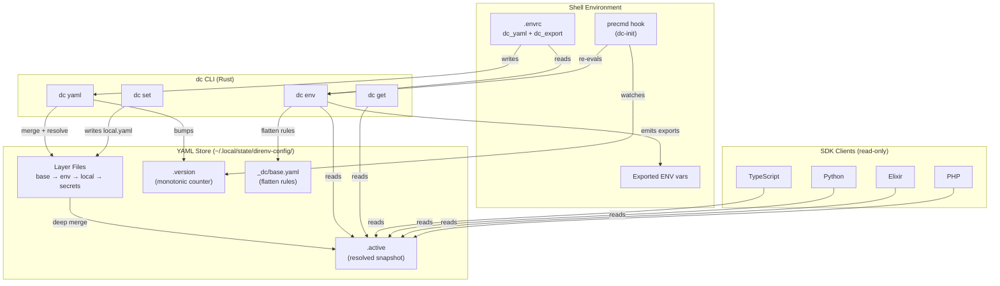

# Project Architecture

## Overview

`direnv-config` replaces sprawling `export VAR=value` `.envrc` files with structured, versioned, mergeable YAML configs. A Rust CLI (`dc`) manages config stores on disk; a direnv stdlib extension (`dc_yaml`, `dc_export`) bridges the YAML store into shell environment variables. A `precmd` shell hook watches for version changes, enabling child-process IPC — any process can mutate the YAML store and the parent shell picks up changes on the next prompt.

Four read-only SDK clients (TypeScript, Python, Elixir, PHP) provide application-level access to resolved configs without shelling out.

## System Diagram

## Core Components

| Component | Purpose |
|-----------|---------|
| `src/cmd/` | CLI subcommands (yaml, get, set, env, init, list, bump, prune, purge, secrets, status, unset) |
| `src/store/` | Store discovery, layout, version tracking, layer resolution, parent-chain merging |
| `src/yaml/` | Deep merge engine, path expression evaluator, flatten-to-env-var system |
| `lib/direnv-stdlib.sh` | direnv extension functions (`dc_yaml`, `dc_export`, `dc_get`, `dc_set`) |
| `bin/dc-init` | Shell hook generator — registers `precmd` for version-based IPC |
| `sdk/` | Read-only clients in 4 languages with native and CLI backends |

## Layer Resolution

Configs within a single store resolve by deep-merging YAML layers in fixed order: `base.yaml` -> `{DC_ENV}.yaml` -> `local.yaml` -> `secrets.yaml`. The merged result is written to `.active`.

-> *See [arch/layer-resolution.md](arch/layer-resolution.md) for details*

## Parent Chain Inheritance

Stores form an implicit hierarchy based on filesystem path. A store for `/Users/keith/Github/k8/projects` inherits from `/Users/keith/Github/k8` if that store exists. Resolution walks the ancestor chain and deep-merges `.active` files from oldest to newest. A `_dc_pruned: true` tombstone at any level discards all prior layers.

-> *See [arch/parent-chain.md](arch/parent-chain.md) for details*

## Flatten Rules

The `_dc` named config contains flatten rules that map config paths to environment variable names. Explicit rules map `config.key.path` to `ENV_VAR`. Wildcard rules (`tab.*: TAB_*`) iterate all keys at a level. The `dc env` command evaluates all rules and emits `export` statements with proper shell escaping.

-> *See [arch/flatten-rules.md](arch/flatten-rules.md) for details*

## IPC Model

Child processes cannot modify a parent's environment directly. `dc` works around this by writing to the shared YAML store and bumping `.version`. The `precmd` hook (installed by `dc-init`) compares the version counter on each prompt and re-evaluates `dc env` when it changes. This enables cross-process communication — a deploy script can `dc set tab status "deploying"` and the parent shell's tab title updates on the next prompt.

## Technology Stack

| Layer | Technology |
|-------|-----------|
| CLI | Rust (clap, serde_yaml, anyhow, chrono, sha2) |
| Shell integration | POSIX sh / zsh / bash |
| Config format | YAML (serde_yaml) |
| State location | `~/.local/state/direnv-config/` (XDG_STATE_HOME) |
| Store addressing | Path-to-name: strip leading `/`, replace `/` with `-`, SHA-256 truncation at 200 chars |
| SDKs | TypeScript, Python, Elixir, PHP — native (file read) + CLI backends |

## Key Decisions

- **File-based IPC over sockets**: Simpler, survives process restarts, works across unrelated processes
- **Monotonic version counter**: Cheap change detection without filesystem watchers
- **Deep merge with tombstones**: `_dc_pruned: true` allows child stores to explicitly delete inherited config without removing the parent
- **Flatten rules in `_dc` config**: Decouples YAML structure from env var naming — the mapping is itself configuration
- **SDK dual backends**: Native backend reads YAML directly (no `dc` binary needed); CLI backend shells out for compatibility
