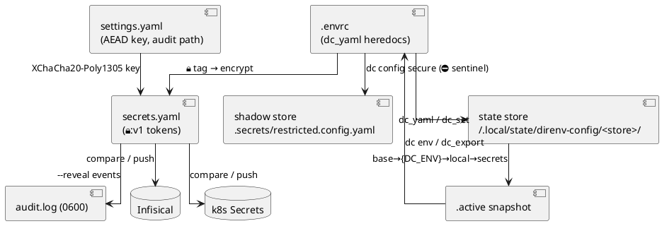

# Project Schema — Persistence & Config Artifacts

> **No persistence layer.** `direnv-config` has **no database, no SQL schema, and no
> Liquibase changelogs**. All persistence is file-based: YAML stores on disk, heredoc
> blocks embedded in `.envrc` files, encrypted secret tokens, and remote address
> schemes (Infisical / Kubernetes). This document is the structure reference for
> those artifacts. **No secret values appear here — formats only.**

## Artifact Map

```mermaid
graph TD
    ENVRC[".envrc (source of truth)<br/>dc_yaml heredocs per named config"] -->|dc_yaml / dc_set writes| STORE["state store<br/>~/.local/state/direnv-config/&lt;store&gt;/"]
    ENVRC -->|🔒 tag| SECRETS["secrets.yaml layer<br/>🔒:v1 encrypted tokens"]
    ENVRC -->|⛔ sentinel| SHADOW["shadow store<br/>&lt;project&gt;/.secrets/restricted.config.yaml"]
    STORE -->|resolve: base→env→local→secrets| ACTIVE[".active snapshot"]
    ACTIVE -->|flatten rules (_dc)| ENVVARS["env vars<br/>dc env / dc_export"]
    SECRETS -->|compare/push| INFISICAL["infisical:// addresses"]
    SECRETS -->|compare/push| K8S["k8:// addresses"]
    SETTINGS["settings.yaml<br/>~/.config/direnv-config/"] -->|AEAD key| SECRETS
    STORE --> AUDIT["audit.log (0600)"]
```



## `.envrc` — source of truth

Config source lives **inside `.envrc` heredoc blocks**, one per *named config*
(subject). There is no separate `.envrc.dc` file in this project.

```bash
# .envrc (structure)
dc_yaml <name> <<'YAML'
<key>: <value>              # plain scalars/maps
<key>: "🔒<secret>"         # 🔒 prefix → encrypted, routed to secrets.yaml
<key>: "🎲 <name> 🔒 hex 32" # 🎲 placeholder → dc gen-secrets fills in place
YAML

dc_yaml <name> --layer secrets   # target a specific layer explicitly
dc_prune <name> [<key>...]       # tombstone (_dc_pruned: true) a config/branch
dc_set <name> <key> <value>      # writes land in local.yaml (via IPC)
dc_bump                          # finalize after batched writes
```

| Marker | Meaning |
|--------|---------|
| *(none)* | plaintext, stored per `--layer` (default base) |
| `🔒` | secret — encrypt to `🔒:v1` token, route to `secrets.yaml` |
| `❗`×0–3 | sensitivity tier suffix on `🔒` (low → high) |
| `🎲 <name> 🔒 <charset> <len>` | generator placeholder for `dc gen-secrets` |
| `⛔` | restricted sentinel — value lives in shadow store only |

## State store layout

One store per directory with an `.envrc`, named by path hash (strip leading `/`,
`/`→`-`; >200 chars truncated + 8-hex SHA-256 suffix). Under
`$XDG_STATE_HOME/direnv-config/` (default `~/.local/state/direnv-config/`):

```
<store-name>/
├── .version                  # monotonic integer counter
├── .meta                     # source abs path, timestamps, full hash
├── <config-name>/            # one dir per named config
│   ├── base.yaml             # committable defaults
│   ├── {DC_ENV}.yaml         # env overlay (DC_ENV defaults dev)
│   ├── local.yaml            # personal overrides / IPC writes (gitignored)
│   ├── secrets.yaml          # 🔒:v1 encrypted values (gitignored)
│   └── .active               # resolved merge snapshot
├── _dc/base.yaml             # special config: flatten rules, prefix, export list
└── history/NNN-<ISO8601>.yaml  # append-only snapshots
```

### Layer resolution order (per config)

`base.yaml` → `{DC_ENV}.yaml` → `local.yaml` → `secrets.yaml` → written to `.active`.
Missing layers skipped. Deep-merge: maps recurse, sequences/scalars replace,
`_dc_pruned: true` tombstones prune the subtree. Cross-store: parent chain
(`Users-…-k8` ← `Users-…-k8-projects`) merges ancestor-first; a root-level
`_dc_pruned: true` in a child breaks inheritance for that config.

**Note:** this layering is project-local. The monorepo's `dc:/override:/auto:/default:`
credential-prefix scheme is a consumer convention layered on top — `dc` itself
resolves only the four files above plus the parent chain.

## Encrypted token & shadow store formats

| Artifact | Format | Notes |
|----------|--------|-------|
| Secret token | `🔒:v1:<ciphertext>` | XChaCha20-Poly1305 AEAD; key = base64 32-byte value in settings.yaml. Key rotation orphans existing tokens (loud failure) |
| Shadow store | `<project>/.secrets/restricted.config.yaml` | Created by `dc config secure`; store + `.envrc` keep only a `⛔` sentinel; requires `--reveal-restricted` |
| Audit log | `$audit_log` or `~/.local/state/direnv-config/audit.log` | Append-only, mode 0600; records every `--reveal` / `--clippy` / `--reveal-restricted` |

## `settings.yaml` (global)

Path resolution: `$DC_SETTINGS` → `$XDG_CONFIG_HOME/direnv-config/settings.yaml`
→ `~/.config/direnv-config/settings.yaml`.

| Key | Type | Required | Description |
|-----|------|----------|-------------|
| `key` | string | Yes | base64-encoded 32-byte XChaCha20-Poly1305 key (generate: `openssl rand -base64 32`) |
| `audit_log` | string | No | Override audit-log path |

## Remote address schemes

Used by `dc compare` / `dc push` / `dc infisical` — values never printed.

| Scheme | Shape | Example |
|--------|-------|---------|
| Infisical | `infisical://<project>/<KEY_PATH>` | `infisical://cf/CF_API_TOKEN` |
| Kubernetes | `k8://<namespace>/<secret-name>/<KEY>` (`kubernetes://` alias) | `k8://apps-ns/cf-secrets/CF_API_TOKEN` |
| Infisical mapping | `/section/KEY` (against `.infisical-secrets.yaml`) | `dc infisical get POSTGRES_PASSWORD` |

Connection settings resolve from env vars, then `dc get secrets infisical.*` /
`dc get cf access.*` from the resolved configs.

## Derived env vars

`dc env` (evaled by the `.envrc` helper `dc_export`) emits, driven by the `_dc`
config's `flatten:` rules (explicit `path: VAR` and wildcard `prefix.*: PREFIX_*`):

- Reserved: `DC_ROOT`, `DC_VERSION`, `DC_ENV`
- Mapped keys per `flatten`; unmapped keys export as `PREFIX_PATH_TO_KEY`
  (uppercase, dots→underscores) for keys listed in `_dc.export`
- Shell-special values are single-quote escaped

## Fixture contracts

`demo/expected-state/*.yaml` are the golden resolved outputs for the demo trees
(`root.yaml`, `projects.yaml`, `k8.yaml`, `staging.yaml`, `design.yaml`);
`sdk/contract-tests/expectations.yaml` pins cross-SDK read/write behavior. Both
must be updated alongside any resolution/merge semantics change.
