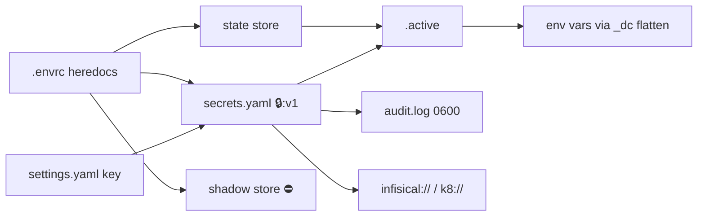

# Project Schema — Summary

> **No persistence layer** — no database/SQL. All state is file-based config
> (YAML stores, `.envrc` heredocs, encrypted tokens, Infisical/K8s address schemes).
> Full reference: [PROJ-SCHEMA.md](PROJ-SCHEMA.md). Structure only — never values.

## Artifacts at a glance

| Artifact | Location | Role |
|----------|----------|------|
| `.envrc` | each project dir | Source of truth; `dc_yaml <name> <<'YAML'` heredoc per named config |
| State store | `$XDG_STATE_HOME/direnv-config/<path-hash>/` | Per-directory resolved config; `.version`, `.meta`, `<config>/{base,{DC_ENV},local,secrets}.yaml`, `.active`, `history/` |
| Secret token | `secrets.yaml` layer | `🔒:v1:<ciphertext>` — XChaCha20-Poly1305; `❗`×0–3 tiers |
| Shadow store | `<project>/.secrets/restricted.config.yaml` | `dc config secure` target; `⛔` sentinel left behind |
| settings.yaml | `~/.config/direnv-config/settings.yaml` | `key` (base64 32-byte AEAD), optional `audit_log` |
| Audit log | store dir `audit.log` (0600) | Append-only reveal history |
| Golden fixtures | `demo/expected-state/*.yaml`, `sdk/contract-tests/expectations.yaml` | Resolution/SDK contracts |

## Layer resolution

`base.yaml` → `{DC_ENV}.yaml` → `local.yaml` → `secrets.yaml` → `.active`; then
parent-chain merge ancestor-first. Maps deep-merge; sequences/scalars replace;
`_dc_pruned: true` tombstones prune (root-level = break inheritance).

## Markers

`🔒` secret · `❗`×0–3 tier · `🎲` generator placeholder · `⛔` restricted sentinel

## Remote schemes

`infisical://<project>/<KEY>` · `k8://<ns>/<secret>/<KEY>` · `/section/KEY` (`.infisical-secrets.yaml` roundtrip)

## ERD (artifact relationships, Mermaid)

