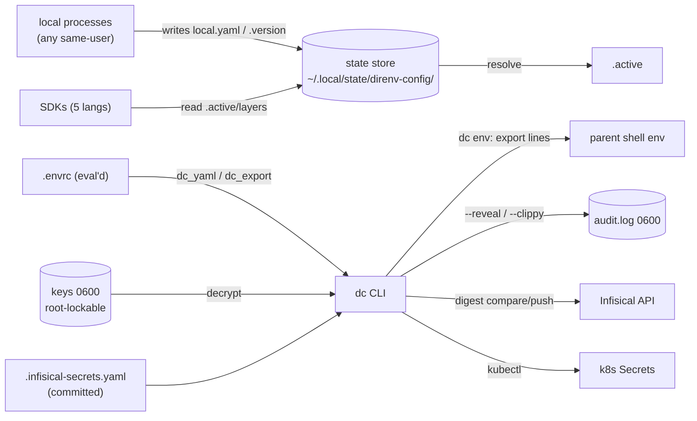

# Threat Model

> Security counterpart to [PROJ-ARCH.md](PROJ-ARCH.md). Workstation-local config
> and secrets tooling: the assets are secret material and the shell environments
> `dc` populates; the adversary model is (a) malicious/compromised same-host
> processes, (b) accidental disclosure (output, commits, logs), (c) tampering in
> transit or at rest with remote secret backends. No secret values appear here.

## Overview

`direnv-config` holds the scalar config and credential layer for the fleet
(`.envrc.k8.dc`: AWS, Docker, Helm, Infisical). Crown jewels, in order: the
XChaCha20-Poly1305 **key file** (`~/.config/direnv-config/keys`, 0600, root-lockable
via `dc keys lock`) — it decrypts every `🔒:v1` token; the encrypted
`secrets.yaml` layers and shadow stores; and the **evaluated shell environment** —
`dc env` output is `eval`'d by `.envrc`, so anything that can write the store can
inject env vars (and thereby shell behavior) into every project directory.

Trust boundaries: (1) same-user processes ↔ store/settings/audit files (no
privilege separation — the key file's root-ownership lock is the one exception);
(2) shell ↔ `.envrc`/direnv stdlib (code execution by design, gated by `direnv
allow`); (3) CLI ↔ remote backends (Infisical API over rustls TLS, kubectl);
(4) repo ↔ local-only artifacts (`secrets.yaml`, `local.yaml`, shadow store,
`.secrets/` are gitignored — accidental commit is a live disclosure path).

## Attack Surface

## Vulnerability Register

| ID | Severity | STRIDE | Component | Status |
|----|----------|--------|-----------|--------|
| T-001 | High | Tampering / EoP | Store files writable by any same-user process → env-var injection into every shell that evals `dc env` (e.g. `LD_PRELOAD`, `PATH`) | Partial — single-user workstation trust assumption; no MAC/signature on store files |
| T-002 | Critical | Info disclosure | AEAD key exfiltration decrypts all tokens | Mitigated — dedicated key file, 0600 enforced, `dc keys lock` makes it root-owned read-only; loud failure on rotation. Legacy `settings.yaml` key is weaker → `dc keys migrate` |
| T-003 | Medium | EoP | `.envrc` is arbitrary shell by design (direnv model) | Accepted — `direnv allow` re-confirmation gate; `dc_yaml` heredocs keep most content data-only |
| T-004 | Medium | Info disclosure | Secret values reaching terminals, logs, CI output | Mitigated — redaction by default; reveal requires explicit `--reveal`/`--clippy`; remote compare uses SHA-256 digests (no plaintext/length leak) |
| T-005 | Medium | Repudiation | Reveals must be attributable | Partial — append-only 0600 audit log records every reveal, but the log is user-deletable (no external sink) |
| T-006 | Medium | Info disclosure | Accidental commit of `secrets.yaml` / `local.yaml` / `<project>/.secrets/restricted.config.yaml` | Partial — gitignored by convention; shadow store is 0600 but lives inside the project tree; tokens stay ciphertext without T-002 key |
| T-007 | Low | Spoofing / Tampering | Remote backends: Infisical API creds, kubectl context | Mitigated — rustls TLS (no native TLS CA issues), creds resolved from env/config; digest comparison prevents value overwrite guessing |
| T-008 | Low | Tampering | Supply chain: Cargo deps, SDK publishing (`publish-sdks.yml`) | Partial — lockfile pinned; standard CI trust; no artifact signing |

## Mitigation Coverage

2 mitigated · 4 partial · 1 accepted · 1 open-by-design. Partial items share one
root cause: **no privilege boundary between `dc` and other same-user processes**
(workstation trust assumption, T-001/T-005/T-006/T-008 all reduce to it).

## Residual Risk

Same-user compromise = game over (key read or store write) — accepted for a
single-operator dev tool; the root-owned key file (`dc keys lock`) raises the bar
for non-root exfiltration only. Audit log is best-effort forensics, not evidence.
`🎲` auto-generation never happens implicitly in `dc infisical` paths, so secrets
are never silently minted during sync.
